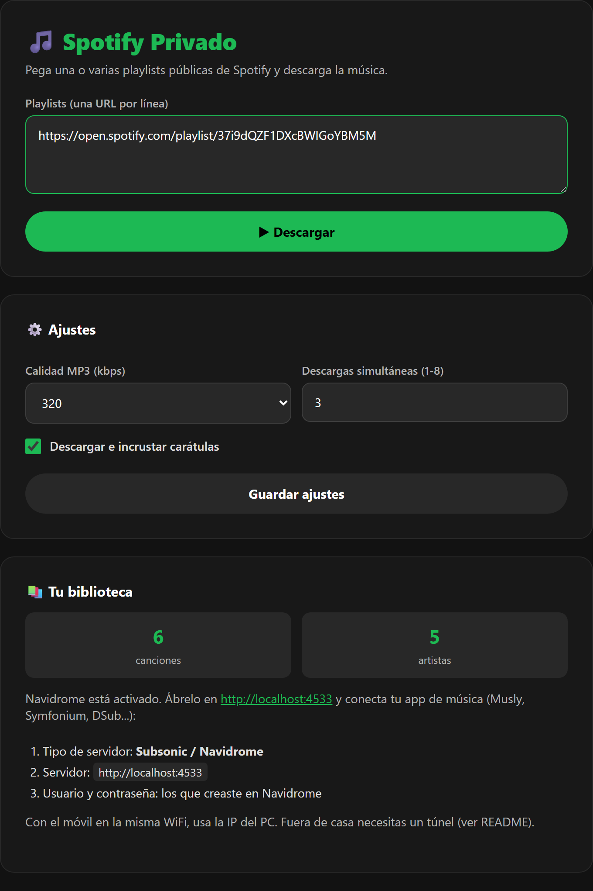

<div align="center">

# 🎵 Spotify Privado

**Tu propio "Spotify" casero: pega una playlist, descarga la música y escúchala donde quieras.**

[Instalación](#-instalación-en-3-pasos) ·
[Panel web](#-el-panel-web) ·
[Navidrome](#-navidrome-opcional) ·
[Escuchar en el móvil](#-escuchar-en-el-móvil-o-pc-con-musly) ·
[Fuera de casa](#-escuchar-fuera-de-casa) ·
[Problemas](#-problemas-frecuentes)

</div>

---

## ¿Qué hace?

1. Lees una playlist **pública** de Spotify (sin API keys ni cuenta de desarrollador).
2. Cada canción se busca y se descarga como **MP3** (con `yt-dlp`).
3. Se corrigen las **etiquetas** (artista, álbum, *feat.*) y se incrustan las **carátulas**.
4. La música queda ordenada en tu carpeta: `Artista/Álbum/Canción.mp3`.
5. *(Opcional)* **Navidrome** sirve esa carpeta por red y la escuchas desde el móvil con una app tipo Spotify.

```
playlist de Spotify ─► scraper ─► yt-dlp ─► MP3 + tags + carátula ─► tu carpeta ─► Navidrome (opcional) ─► app en tu móvil
```

**Tú eliges:** solo descargar la música a una carpeta (y usarla con cualquier reproductor), o descargar *y* montar tu servidor de streaming.

> ⚠️ **Aviso legal.** Pensado para uso personal con música a la que tengas derecho. Descargar contenido con copyright
> puede incumplir los términos de YouTube/Spotify o la ley de tu país. Eres el único responsable de su uso.
> Proyecto independiente, no afiliado a Spotify.

*English: self-hosted playlist downloader (Spotify → tagged MP3s with cover art) with an optional Navidrome streaming server. Run `python setup.py`; the UI is in Spanish.*

---

## 🚀 Instalación en 3 pasos

### Requisitos

| Necesitas | Para qué | Dónde |
|---|---|---|
| **Docker** (Docker Desktop en Windows/Mac) | Ejecuta todo sin instalar nada más | [docs.docker.com/get-docker](https://docs.docker.com/get-docker/) |
| **Python 3** | Solo para el asistente `setup.py` | [python.org](https://www.python.org/downloads/) |
| **Git** | Para clonar el repositorio | [git-scm.com](https://git-scm.com/) |

Docker Desktop tiene que estar **abierto** al instalar. ¿Prefieres no usar Docker? Mira [Sin Docker](#-sin-docker).

### Pasos

```bash
git clone https://github.com/TU_USUARIO/spotify-privado.git
cd spotify-privado
python setup.py
```

El asistente te pregunta cuatro cosas (puedes pulsar Enter para aceptar el valor por defecto):

| Pregunta | Para qué |
|---|---|
| **Contraseña del panel** | Protege el panel web. Si pulsas Enter, genera una aleatoria |
| **Carpeta de música** | Dónde se guardan los MP3. Ruta completa, p. ej. `D:/Musica` o `/home/yo/Musica` |
| **Puertos** | Déjalos por defecto salvo que estén ocupados |
| **¿Quieres Navidrome?** | **Sí** = servidor de streaming para escuchar en el móvil · **No** = solo descargar |

Al terminar te enseña las direcciones, incluida **la IP de tu PC** para conectar el móvil. La primera vez tarda unos
minutos porque construye la imagen. Después abre **http://localhost:8501**, entra con tu contraseña, pega una playlist
y pulsa **Descargar**.

> 💡 En Spotify, para copiar el enlace: playlist → `···` → *Compartir* → *Copiar enlace de la playlist*.
> Tiene que ser una playlist **pública**.

---

## 🖥️ El panel web

Está en `http://localhost:8501` (o `http://IP_DEL_PC:8501` desde otro dispositivo de tu red).

<div align="center">
  
</div>

| Sección | Qué puedes hacer |
|---|---|
| **Descargar** | Pegar una o varias playlists (una URL por línea) y ver el progreso en directo |
| **Ajustes** | Calidad del MP3 (128 / 192 / 256 / 320 kbps o máxima), descargas simultáneas (1-8) y carátulas sí/no. Se guardan solos |
| **Tu biblioteca** | Cuántas canciones y artistas llevas y, si activaste Navidrome, la dirección para conectar tus apps |

- Las canciones **ya descargadas se saltan**: puedes repetir una playlist cada cierto tiempo para añadir solo las nuevas.
- Si pegas varias playlists, las canciones repetidas entre ellas se descargan una sola vez.
- Más descargas simultáneas = más rápido, pero YouTube puede limitarte si te pasas. Con 3 suele ir bien.

---

## 📡 Navidrome (opcional)

[Navidrome](https://www.navidrome.org/) es un servidor de música ligero: lee tu carpeta y la sirve por red
a cualquier app compatible con la API **Subsonic**.

**Primer uso**

1. Abre **http://localhost:4533** (o el puerto que elegiste).
2. La primera vez te pide **crear el usuario administrador**: inventa un usuario y una contraseña y guárdalos,
   los usarás en las apps del móvil.
3. Descarga una playlist desde el panel. Navidrome detecta la música nueva en **≤5 minutos**.

**Reescaneo instantáneo (opcional):** añade `NAVIDROME_USER` y `NAVIDROME_PASSWORD` a tu `.env` y ejecuta
`docker compose up -d`. Así, al terminar cada descarga se fuerza el escaneo al momento.

**Activarlo o quitarlo después:** vuelve a ejecutar `python setup.py` y responde *sí* o *no* a Navidrome.
Tu música no se toca.

---

## 📱 Escuchar en el móvil o PC con Musly

[**Musly**](https://github.com/dddevid/Musly) es una app gratuita con aspecto de Apple Music para Navidrome/Subsonic.
Está disponible para **Android, iOS, Windows, Linux y macOS** y soporta Android Auto, letras sincronizadas,
modo claro/oscuro y reproducción sin conexión. Se descarga desde su
[página de releases](https://github.com/dddevid/Musly/releases).

> Musly es un proyecto de otra persona con su propia licencia (CC BY-NC-SA 4.0). Este repositorio **no la incluye**:
> descárgala siempre de su página oficial.

### Conectar Musly con tu Navidrome

Antes necesitas: el **usuario y contraseña de Navidrome** (los que creaste arriba) y la **IP de tu PC** (la que mostró
`setup.py`; el panel web también la indica). El móvil debe estar en la **misma WiFi** que el PC.

1. Abre Musly. En la pantalla de inicio de sesión, en **Server Type**, elige **Subsonic**
   (Navidrome usa esa API; *Emby / Jellyfin* no es lo tuyo).
2. **Server URL:** `http://IP_DE_TU_PC:4533` — por ejemplo `http://192.168.1.50:4533`.
   Tiene que empezar por `http://` o `https://`, y **no** uses `localhost` desde el móvil (apuntaría al propio móvil).
3. **Username** y **Password:** los de Navidrome.
4. Deja **Legacy Authentication** desactivado (solo es para servidores Subsonic antiguos).
5. *(Opcional)* En **Advanced Options** puedes poner un **Profile Name** (p. ej. `Casa`) para guardar este servidor
   y añadir otro perfil más tarde para cuando estés fuera de casa (p. ej. `Tailscale`).
6. Pulsa **Connect**. Debería aparecer tu biblioteca con las carátulas.

| Si Musly dice… | Qué revisar |
|---|---|
| *Cannot reach server* / timeout | Misma WiFi, IP correcta, puerto 4533, y que el firewall del PC permita ese puerto |
| *Check your username and password* | Usuario/contraseña de Navidrome (no los del panel web) |
| *Verify the server URL path* | Quita cualquier ruta extra: la URL termina en `:4533` |
| La biblioteca sale vacía | Descarga algo desde el panel y espera ≤5 min (o activa el reescaneo instantáneo) |

> 💡 Musly también tiene **Use Local Files** para reproducir música guardada en el propio dispositivo, sin servidor.

### Otras apps compatibles

Cualquier cliente Subsonic funciona con la misma dirección, usuario y contraseña:

| Plataforma | Apps |
|---|---|
| Android | Symfonium (de pago), DSub, Ultrasonic, Tempo |
| iOS | Substreamer, play:Sub, Amperfy |
| Escritorio | Feishin, Supersonic |
| Cualquiera | La web propia de Navidrome en `http://IP_DE_TU_PC:4533` |

---

## 🌍 Escuchar fuera de casa

Necesitas que tu PC sea accesible desde internet. Dos opciones seguras:

- **[Tailscale](https://tailscale.com/)** *(la más fácil)*: instálalo en el PC y en el móvil con la misma cuenta y usa
  la IP de Tailscale del PC como dirección (`http://100.x.y.z:4533`). No abres ningún puerto del router.
- **[Cloudflare Tunnel](https://developers.cloudflare.com/cloudflare-one/connections/connect-networks/)**:
  publica Navidrome con HTTPS en un dominio tuyo.

> 🔒 **Expón solo Navidrome (4533), nunca el panel web (8501)**, y usa contraseñas largas. El panel no usa HTTPS:
> la contraseña viaja en una cabecera.

---

## 🧰 Sin Docker

Requisitos: **Python 3.10+** y [**ffmpeg**](https://ffmpeg.org/) (sin él descarga M4A en vez de MP3).

```bash
python -m venv venv
source venv/bin/activate          # Windows: venv\Scripts\activate
pip install -r requirements.txt
python -m playwright install chromium
```

```bash
# Descargar una o varias playlists
python -m spotifyprivado sync "https://open.spotify.com/playlist/XXXX"

# Re-etiquetar y poner carátulas a una biblioteca existente
python -m spotifyprivado retag

# Panel web (Linux/macOS)
APP_PASSWORD=algo MUSIC_DIR=/ruta/musica python -m spotifyprivado web
```

En Windows (PowerShell): `$env:APP_PASSWORD="algo"; $env:MUSIC_DIR="D:\Musica"; python -m spotifyprivado web`.
También tienes `scripts\install.bat` y `scripts\sync.bat`.

Para Navidrome sin Docker, sigue su [guía de instalación](https://www.navidrome.org/docs/installation/) y apúntalo
a tu carpeta de música.

---

## ⚙️ Configuración avanzada

`python setup.py` genera el archivo `.env`. Puedes editarlo a mano (hay una plantilla en `.env.example`) y aplicar
los cambios con `docker compose up -d`.

| Variable | Para qué | Por defecto |
|---|---|---|
| `APP_PASSWORD` | Contraseña del panel (obligatoria) | — |
| `MUSIC_PATH` | Carpeta de música en tu PC (Docker) | `./music` |
| `WEB_PORT` | Puerto del panel | `8501` |
| `COMPOSE_PROFILES=navidrome` + `NAVIDROME_ENABLED=1` | Activa Navidrome | desactivado |
| `NAVIDROME_PORT` | Puerto de Navidrome | `4533` |
| `NAVIDROME_USER` / `NAVIDROME_PASSWORD` | Reescaneo instantáneo tras descargar | vacío |

La calidad, las descargas simultáneas y las carátulas se cambian desde el panel y se guardan en `config/settings.json`.

---

## 🩺 Problemas frecuentes

<details>
<summary><b>"No se extrajeron tracks"</b></summary>

La playlist es privada o la URL es incorrecta. Hazla pública y copia el enlace desde *Compartir*.
</details>

<details>
<summary><b>"port is already allocated" al arrancar</b></summary>

Otro programa usa ese puerto. Cambia `WEB_PORT` o `NAVIDROME_PORT` en `.env` y ejecuta `docker compose up -d`.
</details>

<details>
<summary><b>No aparece música en Navidrome</b></summary>

Espera 5 minutos o activa el reescaneo instantáneo. Comprueba que `MUSIC_PATH` apunta a la carpeta correcta y que hay
archivos `.mp3` dentro (`Artista/Álbum/Canción.mp3`).
</details>

<details>
<summary><b>El móvil no conecta</b></summary>

Misma WiFi, usa la IP del PC (no `localhost`), puerto 4533, y permite ese puerto en el firewall de Windows
(*Firewall → Reglas de entrada → Nueva regla → Puerto*). Si tu IP cambia a menudo, reserva una IP fija en el router.
</details>

<details>
<summary><b>Algunas canciones fallan o son otra versión</b></summary>

La búsqueda en YouTube es automática (se coge el primer resultado), así que a veces falla o trae un directo/remix.
Es una limitación conocida. Relanzar la playlist reintenta solo las que faltan.
</details>

<details>
<summary><b>Dejó de leer la playlist de golpe</b></summary>

Spotify habrá cambiado su web. Hay que actualizar los selectores en `spotifyprivado/scraper.py`
(abre un *issue* o una *pull request*).
</details>

<details>
<summary><b>Quiero ver qué está pasando</b></summary>

```bash
docker compose logs -f web          # panel y descargas
docker compose logs -f navidrome    # servidor de música
```
</details>

---

## 🔄 Actualizar y desinstalar

```bash
git pull && docker compose up -d --build     # actualizar
docker compose down                          # parar (tu música NO se borra)
docker compose down -v                       # parar y borrar la base de datos de Navidrome (la música sigue intacta)
```

## 🗂️ Estructura del proyecto

```
setup.py                 asistente de instalación (genera .env y arranca Docker)
docker-compose.yml       panel web + Navidrome (opcional)
spotifyprivado/
  scraper.py             lee la playlist de Spotify (Playwright)
  downloader.py          busca y descarga con yt-dlp
  tagging.py             etiquetas ID3 y carátulas
  navidrome.py           reescaneo de Navidrome
  web.py + static/       panel web
scripts/                 atajos para Windows sin Docker
```

## 🤝 Contribuir

¿Encontraste un bug o tienes una idea? Abre un *issue* o una *pull request*. Lo que más ayuda: mantener el scraper al día
con los cambios de Spotify, traducir el panel y añadir capturas de pantalla.

## 📄 Licencia

[MIT](LICENSE) © Marcos Guibas
